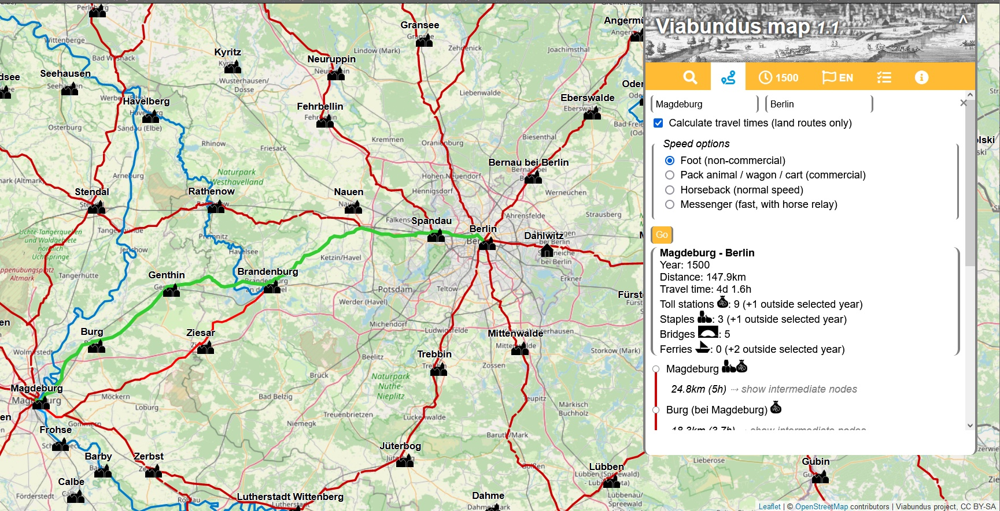

# Viabundus. Map of premodern European transport and mobility.

**Panel 2**. Moving in the past: open solutions for data set design, spatial analysis and geo-statistical methods to investigate movement in Antiquity

- **Maria Carina Dengg**
  - Viabundus. Pre-modern street map. Otto-von-Guericke-Universität, Magdeburg, Germany
  - [maria.dengg@ovgu.de](mailto:maria.dengg@ovgu.de)
  - [@theroadsproject](https://twitter.com/theroadsproject)
  - ORCID: [0000-0003-3614-9651](https://orcid.org/0000-0003-3614-9651)

*The Viabundus application with the display of node information*

*Example for route calculator within the Viabundus map*

Viabundus is a freely accessible online street map of late medieval and early modern Northern Europe (1350-1650). Originally conceived as the digitisation of Friedrich Bruns’ and Hugo Weczerka's Hansische Handelsstraßen (1962) atlas of land roads in the Hanseatic area, the resulting Viabundus application has turned out to be much more.

In order to allow scholars further research within the scope of network analysis and estimations of transaction costs, Viabundus is conceived as a network model, comprised of nodes and edges. The underlying database allows for the supply of additional information to each edge and node. Within several regional subprojects, the Viabundus database was filled with information on settlements, towns, tolls, staples, fairs as well as infrastructural features such as bridges and ferries. The resulting traffic connections (edges) were then reconstructed using historical maps, source material, as well as existing work on route reconstruction, some of which are based on field work. It is important to keep in mind that while Viabundus makes an effort to show exact geographical road reconstructions wherever possible, its main focus is on routes and therefore the displayed connections were almost certainly not the only way to reach a certain node.

The collected data was also used to comprise a fair calendar as well as a preliminary route calculator, which is based on a least-cost-analysis.

Version 1.1 of the map has been online since December 2021 and includes the researched and revised land- and waterways of Northern and Middle Germany, the Netherlands and Denmark, which can be viewed at viabundus.eu. Since then the project has expanded to Viabundus Finland, which begins its work in mid 2022. Another aspect of the project lies within its potential for public involvement as well as public interest, which is the main focus of Viabundus via Brabant.
The project is always on the lookout for new partners as its work is far from done. Future perspectives include research and mapping of Eastern European areas as well as the mapping of waterways.
This paper aims at introducing Viabundus and its methods, as well as exploring its research potential in the context of the data being fully publicly accessible.

**License**
The text and image are released under CC BY-ND 4.0 International license, copyright by Maria Carina Dengg 2022
